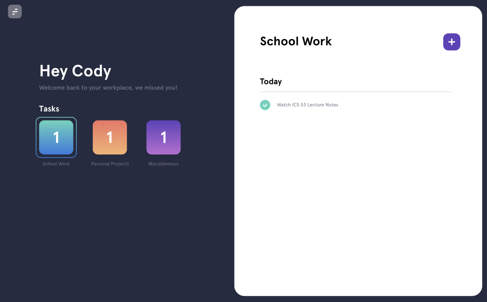

# Tasque - task manager 

Tasque is a task manager web application built on a MERN stack. The front-end is built with React.js, styled-components, and material-ui. The back-end uses node.js, express.js, and mongoose to connect to a MongoDB Atlas cluster. 

  

## How it was made

- React.js
- Node.js
- Express
- React Hooks
- MongoDB